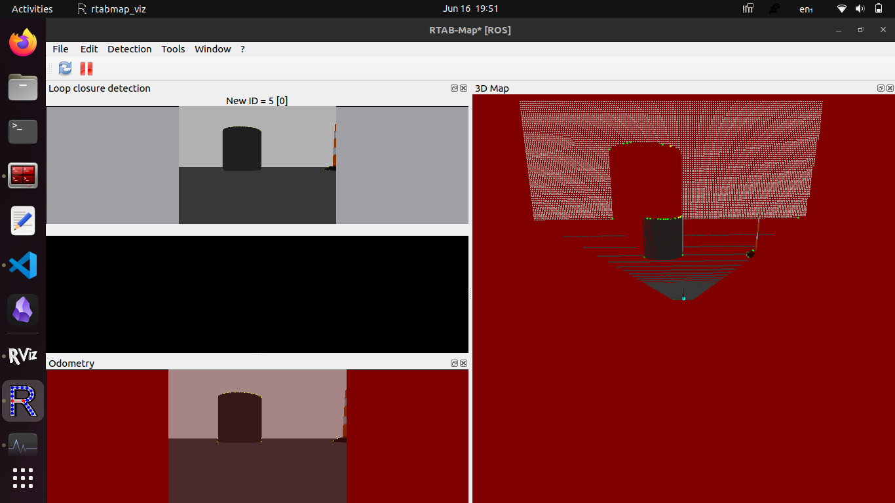
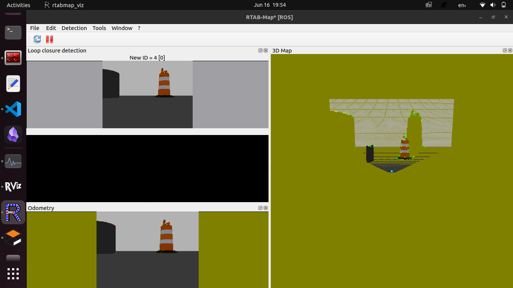
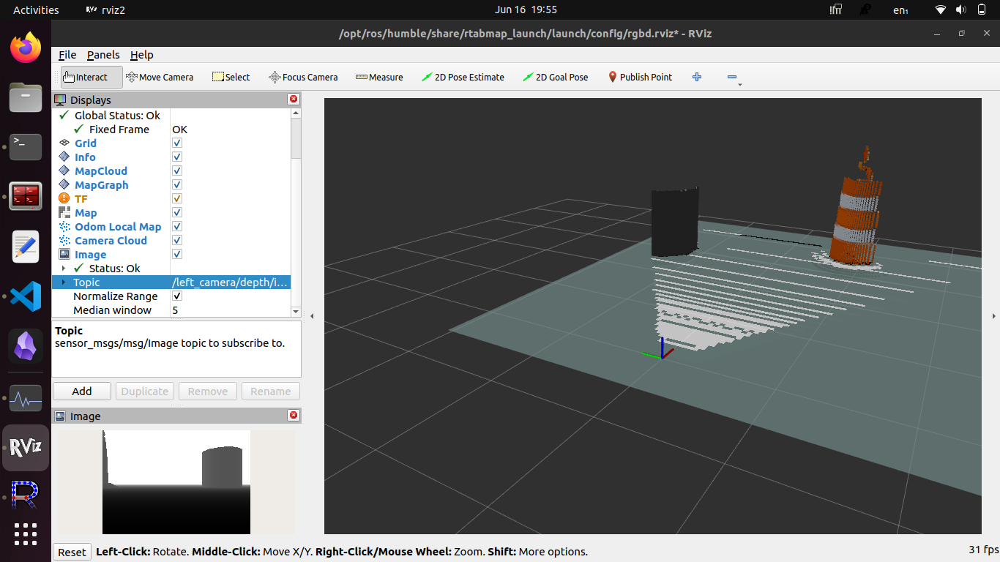
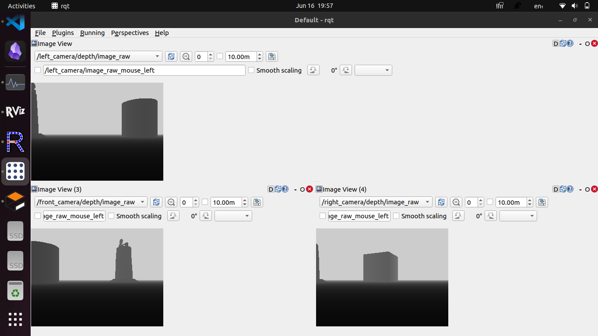
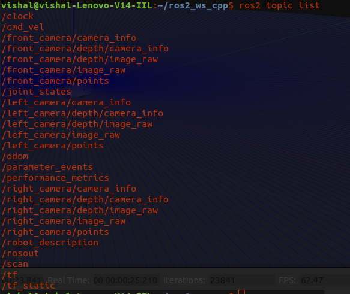

# Cleaning Bot Simulation

This repository contains a ROS 2 simulation for a robot having depth cameras using Gazebo Classic and RTAB-Map for SLAM. You will be ablle to generate the 3D RGBD map with the following commands.

## Prerequisites

- **Ubuntu 22.04**
- **ROS 2 Humble** 
- **Gazebo Classic**

## Installation

1. Install RTAB-Map ROS package:
   ```bash
   sudo apt install ros-humble-rtabmap-ros

# Follow the commands
   ```
   mkdir -p ~/ros2_ws/src
   cd ~/ros2_ws/src

# Clone the repository
   git clone https://github.com/tirpudevk111/cleaning_bot_sim.git


# Build the package
   cd ~/ros2_ws
   colcon build --symlink-install

# launch the gazebo with bot having 3 depth cameras.
   launch_sim.launch.py
   
# Run R-TAB Map
   ros2 launch rtabmap_launch rtabmap.launch.py rtabmap_args:="--delete_db_on_start"   rgb_topic:=/front_camera/image_raw   depth_topic:=/front_camera/depth/image_raw   camera_info_topic:=/front_camera/camera_info   frame_id:=front_camera_link   approx_sync:=true   rviz:=true

## 3D RGBD map with rtabmap



## RViz2 


## Depth perseption of left fron and right camera in rqt


## Ros2 Topic list

